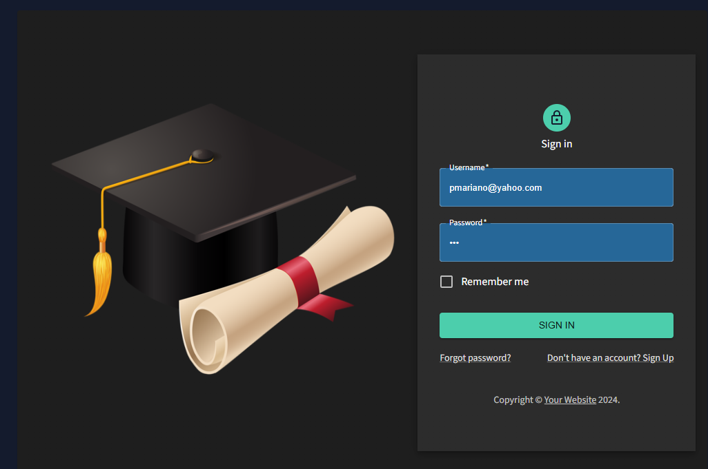
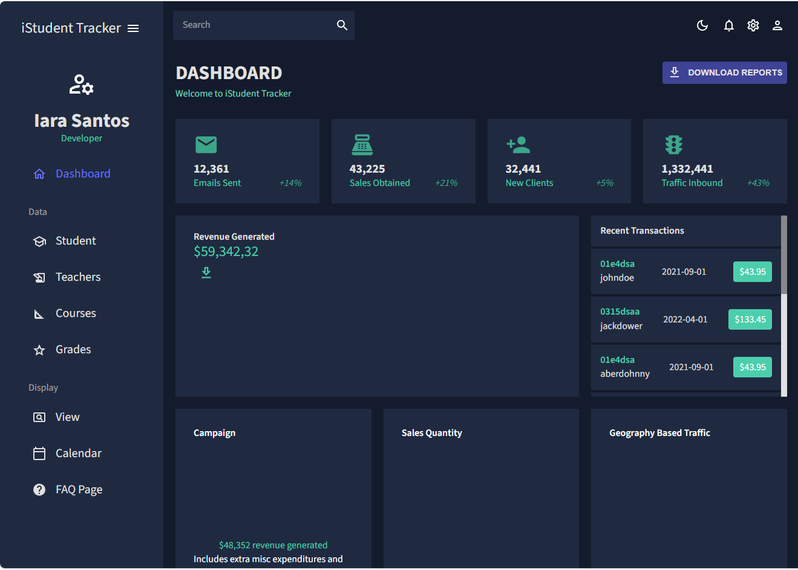
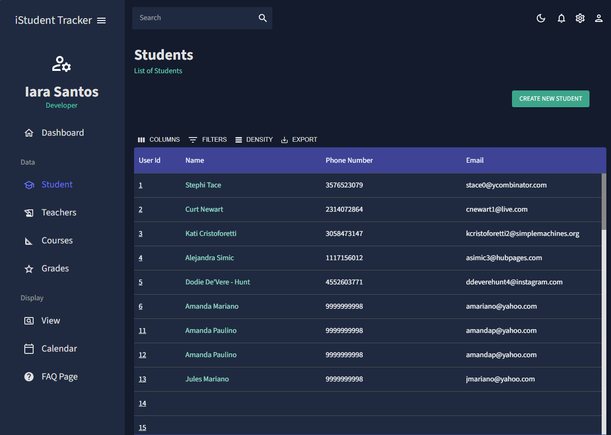
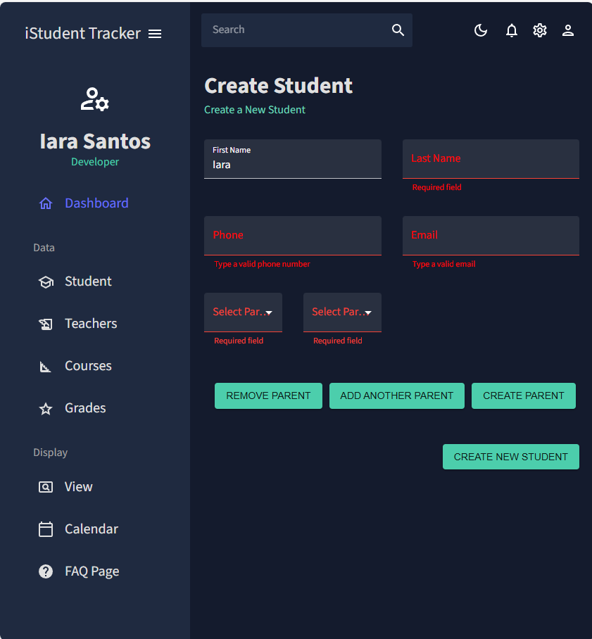

# iStudentmicroservice
Application to manage students, parents, teacher, courses and grade

## Backend
### Microservices
* Naming Service - Eureka Discovery Server
* Api Gateway - Spring Cloud Gateway
* User Service - To manage users and login
* Student Service - To manage students
* Teacher Service - To manage teacher
* Parent Service - To manage students' parents
* Course Service - To manage courses
* Grade Service - To manage grades

### Database
- Mysql, jpa, and flyway

### Documentation - Aggregated Swagger
OpenApi, Swagger

#### To access:

1. Run all services
2. Head to localhost:8080/swagger-ui.html
3. Select different services from the top right Select a definition dropdown
 
### Security
* SpringBoot Security

## Frontend
* Javascript, React, Material-UI, Formik

### Login Page

### Signup Page

### Dashboard Page

### List of Students Page

### Create Student Page

